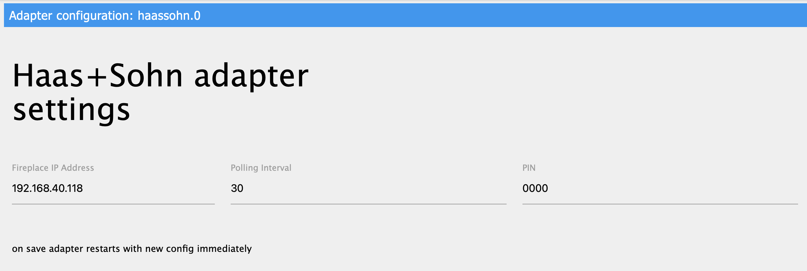

# HaasSohn
Адаптер позволяет контролировать и управлять устройствами Haas & Sohn.

## Конфигурация
Диалог конфигурации адаптера предоставляет следующие настройки:

**FirePlace IP Address:** Локальный IP-адрес камина для мониторинга и управления

**Polling Interval:** Интервал в секундах, в течение которого опрашивается состояние устройства.

**PIN:** PIN-код устройства, который необходим для управления им.